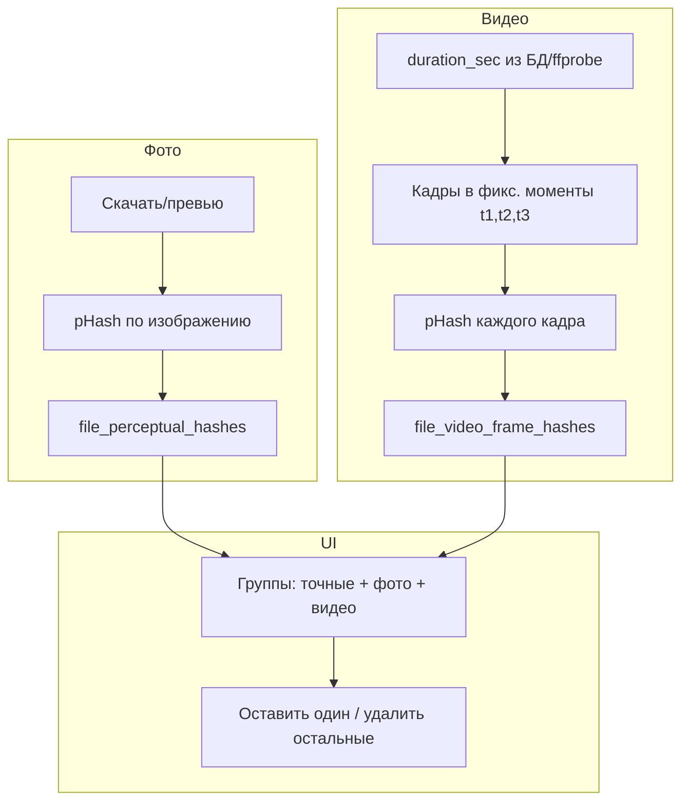

# Вычистка дубликатов разного размера (перцептивный хеш + видео по кадрам)

## Обзор

Сейчас дедупликация находит только файлы с **одинаковым содержимым (SHA256)**. Чтобы вычищать «одинаковые по смыслу» фото и видео разного размера/качества, план:

- **Фото**: перцептивный хеш (pHash/dHash) по изображению → группировка «визуально одинаковые».
- **Видео**: одинаковая длительность + сравнение нескольких кадров с **одинаковой временной отсечкой** (одинаковый момент в ролике) через phash кадра → группировка «тот же ролик, разное разрешение/кодек».

Далее — общая схема, затем отдельно фото и видео, общий UI вычистки.

---

## Текущее состояние

- **Дедупликация**: по SHA256 в таблице [files](backend/common/db.py) (`hash_alg`, `hash_value`). Группы: `list_dup_groups_archive`, `list_group_items`.
- **Страница** [backend/web_api/main.py](backend/web_api/main.py) `/duplicates`: карточки групп, действия «Удалить в корзину», «Переместить в Дети вместе» ([api/duplicates/delete](backend/web_api/main.py), [api/duplicates/move-to-kids](backend/web_api/main.py)).
- **Видео**: в `files` уже есть `duration_sec`, `duration_source` (ffprobe/meta); скрипт [backend/scripts/tools/video_keyframes.py](backend/scripts/tools/video_keyframes.py) умеет получать длительность и извлекать кадры в заданные моменты времени (`_pick_times`, `_extract_frame` через OpenCV).

---

## Общая архитектура

---

## Часть 1: Фото (перцептивный хеш)

- **Таблица** `file_perceptual_hashes`: `file_id`, `algorithm` (например `pHash`), `value` (hex), `computed_at`. Уникальность `(file_id, algorithm)`, индекс `(algorithm, value)`.
- **Расчёт**: при скане/отдельном job для файлов с `media_type=image` — скачать (или превью), Pillow + imagehash → phash, запись в БД.
- **Группы**: одинаковый `(algorithm, value)` → «визуально одинаковые» (первая версия без порога по расстоянию Хэмминга).
- **Зависимости**: Pillow + imagehash в основном проекте или расчёт в окружении с face (где уже есть Pillow/OpenCV).

---

## Часть 2: Видео (длительность + кадры с одинаковой временной отсечкой)

Идея: два ролика считаем «одним и тем же контентом», если у них **одинаковая длительность** (или в пределах малого допуска) и **несколько кадров в одних и тех же моментах времени** визуально совпадают (phash).

### 2.1 Критерии

- **Длительность**: брать из `files.duration_sec` (уже заполняется ffprobe/мета). Группа кандидатов: все видео с одинаковой длительностью (или разница ≤ 1 сек, если решим учитывать округление).
- **Временные отсечки**: фиксированные моменты относительно длительности, например:
  - 3 кадра: например 10%, 50%, 90% длительности (или 0.05*dur, 0.5*dur, 0.95*dur как в [video_keyframes.py](backend/scripts/tools/video_keyframes.py) `_pick_times`),  
  - либо фиксированные секунды для коротких (например 0.5, середина, конец минус 0.5).
- **Сравнение**: для каждого видео храним phash кадра в моменты t1, t2, t3. Два видео в одну группу, если:
  - `duration_sec` совпадает (или в допуске),
  - для каждой отсечки t1, t2, t3 phash кадра совпадает (или расстояние Хэмминга ниже порога).

### 2.2 Хранение

- Вариант A: таблица `file_video_frame_hashes (file_id, duration_sec, time_offset_sec, phash_value, computed_at)`. Один file_id — несколько строк (по числу отсечек). Группировка: сначала по `duration_sec`, затем ищем файлы, у которых совпадают все (или N из M) phash по одинаковым `time_offset_sec`.
- Вариант B: одна строка на файл с агрегатом, например `file_id, duration_sec, phash_t1, phash_t2, phash_t3, computed_at`. Группировка: по `duration_sec`, затем сравнение наборов (phash_t1, phash_t2, phash_t3) — проще запросы, но жёстко 3 отсечки.

Рекомендация: **вариант A** (нормализованно, легко менять число отсечек и пороги).

### 2.3 Вычисление

- Для архива на YaDisk: видео нужно скачивать (или временно получать по URL) для извлечения кадров. Переиспользовать логику скачивания из `_dedup_scan_archive` (временный файл).
- Цепочка: скачать видео → OpenCV (или ffmpeg) извлечь кадр в момент `t_sec` → сохранить кадр во временный файл (или передать в память) → Pillow/imagehash → phash. Можно вынести в общий модуль использования [video_keyframes.py](backend/scripts/tools/video_keyframes.py) (например вызов `_extract_frame` во временный файл, затем расчёт phash по этому файлу).
- Отсечки: единый список для всего проекта, например 3 момента — `[0.05*dur, 0.5*dur, 0.95*dur]` с округлением до десятых секунды, чтобы у разных файлов с одной длительностью были одинаковые `time_offset_sec` (например 1.5, 15.0, 28.5 при dur=30).

### 2.4 Сопоставление длительности

- В БД уже есть `files.duration_sec`. Для видео без длительности — дорасчитать через ffprobe (как сейчас в [main.py](backend/web_api/main.py)) перед заполнением `file_video_frame_hashes`.
- Группы кандидатов: `SELECT file_id, path FROM files WHERE media_type = 'video' AND duration_sec = ? AND ...`. При допуске (например ±1 сек) — группировать по округлённой длительности (например `ROUND(duration_sec)` или диапазоны).

---

## Часть 3: UI вычистки

- На странице [backend/web_api/templates/duplicates.html](backend/web_api/templates/duplicates.html):
  - Вкладки/режимы: «Точные дубли (SHA256)», «Визуально похожие фото», «Похожие видео (длительность + кадры)».
- Для каждой группы — тот же паттерн: карточки файлов, выбор «оставить один» (prefer_path), кнопки «Удалить в корзину» / «Переместить в Дети вместе». Переиспользовать [api/duplicates/delete](backend/web_api/main.py) и [api/duplicates/move-to-kids](backend/web_api/main.py).
- API: например `GET /api/duplicates/similar-photo-groups` и `GET /api/duplicates/similar-video-groups` (или один эндпойнт с `type=photo|video`).

---

## Порядок работ (кратко)

**MVP (первая версия):** только пункты 1, 2, 4 (фото), 5. Видео — отдельный этап после стабилизации фото.

1. **Схема БД**: таблицы `file_perceptual_hashes`, (позже) `file_video_frame_hashes` (в [backend/common/db.py](backend/common/db.py)), миграция/init_db.
2. **Фото**: модуль расчёта phash (Pillow + imagehash), запись в `file_perceptual_hashes`; интеграция в скан или отдельный job; метод `list_similar_image_groups_archive`.
3. **Видео** (этап 2): единые отсечки по длительности (например 3 момента); извлечение кадра в t_sec (переиспользовать video_keyframes/OpenCV/ffmpeg), phash кадра → `file_video_frame_hashes`; метод `list_similar_video_groups_archive` (по duration_sec + совпадение phash по отсечкам).
4. **API и UI**: эндпойнты групп похожих фото (MVP), затем видео; вкладки на `/duplicates`, переиспользование существующих действий удаления/перемещения.
5. **Документация**: README, History.log.

---

## Важные файлы

| Назначение                   | Файл                                                                                                                                       |
| ---------------------------- | ------------------------------------------------------------------------------------------------------------------------------------------ |
| Схема, DedupStore            | [backend/common/db.py](backend/common/db.py)                                                                                               |
| Скан архива, SHA256          | [backend/web_api/main.py](backend/web_api/main.py) (`_dedup_scan_archive`)                                                                 |
| Длительность видео (ffprobe) | [backend/web_api/main.py](backend/web_api/main.py)                                                                                         |
| Извлечение кадров видео      | [backend/scripts/tools/video_keyframes.py](backend/scripts/tools/video_keyframes.py)                                                       |
| Страница дубликатов          | [backend/web_api/main.py](backend/web_api/main.py), [backend/web_api/templates/duplicates.html](backend/web_api/templates/duplicates.html) |

---

## Итог

- **Фото**: phash по файлу → группы «визуально одинаковые».
- **Видео**: одинаковая длительность + phash нескольких кадров с **одинаковой временной отсечкой** (одни и те же моменты в ролике) → группы «тот же ролик, разное качество/размер».
- Вычистка: один интерфейс — выбор «оставить один», остальные в корзину или в папку.

---

## Риски и упрощения

- **Производительность**: расчёт phash по всему архиву может быть долгим (скачивание + decode). Имеет смысл делать ограничение по количеству файлов за один запуск и/или фоновую задачу с прогрессом.
- **Видео**: в первой версии не включать; после стабилизации фото — отдельный этап (ключевые кадры + phash).
- **Ложные срабатывания**: очень похожие, но разные фото могут дать близкий phash; порог и визуальная проверка в UI остаются важны (пользователь сам выбирает «оставить один»).
