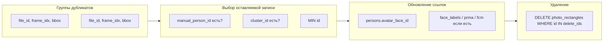

# План: анализ и вычистка дубликатов прямоугольников лиц

## Контекст

- **Таблица:** [backend/common/db.py](backend/common/db.py) — `photo_rectangles`: хранит прямоугольники лиц по файлам (`file_id`, `bbox_x/y/w/h`, для видео ещё `frame_idx`).
- **Привязки** (их нужно сохранять):
  - `manual_person_id` — ручная привязка к персоне;
  - `cluster_id` — привязка к кластеру лиц (персона через `face_clusters.person_id`).
- **Внешние ссылки на `photo_rectangles.id`:**
  - `persons.avatar_face_id` — аватар персоны (обязательно обработать при удалении);
  - таблицы `face_labels`, `person_rectangle_manual_assignments`, `face_cluster_members` в рабочем коде не используются (данные перенесены в `photo_rectangles`), но могут ещё существовать в БД — при удалении записей их тоже нужно учитывать, если таблицы есть.
- Дубликаты возникают из‑за отсутствия уникального ограничения по `(file_id, frame_idx, bbox)` и повторных прогонов/ручного добавления: на одном фото два и более прямоугольника с одинаковыми или очень близкими координатами на одно лицо.

**Жёсткое правило:** прямоугольники с привязками (**manual_person_id** или **cluster_id** не NULL) **не удаляем ни при каких обстоятельствах**, кроме двух уточнений ниже.

**Уточнение 1 — одна и та же персона:** если в группе дубликатов оба прямоугольника привязаны к **одной и той же персоне** (по `manual_person_id` или по `cluster_id` → `face_clusters.person_id`), один из двух можно удалить: оставляем один (например с меньшим `id`), второй удаляем после переноса ссылок (`persons.avatar_face_id` и при наличии — старых таблиц).

**Уточнение 2 — посторонний:** если прямоугольник привязан к персоне **«Посторонний»** (ID через `get_outsider_person_id()` в [backend/common/db.py](backend/common/db.py)), его **можно удалить**. В группе из двух: если один Посторонний, другой — другая персона, удаляем прямоугольник с Посторонним; если оба Посторонние — удаляем один из двух.

В остальных случаях: в группе две записи с привязками к **разным** персонам (и ни одна не Посторонний) — ни одну не удаляем (дубликат сохраняется до ручного разбора).

## Масштаб (результаты анализа БД)

| Показатель                                                                    | Значение        |
| ----------------------------------------------------------------------------- | --------------- |
| Всего записей в `photo_rectangles`                                            | 54 575          |
| Групп дубликатов (одинаковые file_id, frame_idx, bbox)                        | 16 448          |
| Записей в этих группах                                                        | 32 896          |
| Записей с привязкой среди дубликатов (не удаляем)                             | 8 541           |
| Записей без привязки среди дубликатов (кандидаты на удаление)                 | 24 355          |
| Групп, где есть хотя бы одна запись с привязкой                               | 8 497 из 16 448 |
| Записей к удалению (оставляем по одной в группе, удаляем только без привязок) | до 16 448       |

В каждой группе дубликатов ровно 2 прямоугольника. При применении правила «прямоугольники с привязками не удаляем» фактическое число удалений может быть меньше 16 448 (в группах, где обе записи с привязками, ни одну не удаляем). После миграции ожидаемое число записей в `photo_rectangles`: не менее 38 127.

## 1. Анализ

**Цель:** понять масштаб и типы дубликатов.

- **Критерий дубликата (фаза 1 — точное совпадение):** одна группа = одинаковые `file_id`, `COALESCE(frame_idx, -1)` и все четыре поля bbox: `bbox_x`, `bbox_y`, `bbox_w`, `bbox_h`. В группе дубликатов — все записи, у которых эти поля совпадают.
- **Опционально (фаза 2 — «почти одно лицо»):** считать дубликатами прямоугольники с перекрытием по IoU выше порога (например 0.5) в рамках одного `file_id` и `frame_idx`. Это можно добавить отдельным скриптом/режимом после точных дубликатов.

**Скрипт анализа** (режим только чтение):

- Подключение к БД через [backend/common/db.py](backend/common/db.py) (`get_connection`, `DB_PATH`).
- Запрос: сгруппировать по `(file_id, COALESCE(frame_idx, -1), bbox_x, bbox_y, bbox_w, bbox_h)`, считать количество записей в группе; оставить группы с `COUNT(*) > 1`.
- Вывести:
  - число групп дубликатов;
  - общее число записей в этих группах и сколько из них можно удалить (в каждой группе оставляем 1);
  - разбивку: в скольких группах есть хотя бы одна запись с `manual_person_id` или `cluster_id`, и сколько «пустых» групп (без привязок).
- Опционально: вывести несколько примеров групп (file_id, bbox, id записей, наличие manual_person_id/cluster_id) для ручной проверки.

Размещение скрипта: [backend/scripts/debug/](backend/scripts/debug/) (например `analyze_duplicate_rectangles.py`), по правилам проекта — отладочные скрипты там.

## 2. Стратегия вычистки (миграция)

**Принцип:** в каждой группе дубликатов оставляем **одну** запись (кандидат на сохранение), остальные удаляем по правилам ниже. Записи **без** привязок всегда можно удалить (кроме кандидата). Записи **с** привязкой удаляем только если: (1) привязаны к той же персоне, что и кандидат — удаляем дубликат; (2) привязаны к персоне «Посторонний» — удаляем. Выбор «кого оставить» (кандидат в группе):

1. Если в группе есть запись с `manual_person_id IS NOT NULL` — кандидат одна из них (например с минимальным `id`); при равной персоне можно удалять остальные с той же персоной и прямоугольники с Посторонним.
2. Иначе если есть запись с `cluster_id IS NOT NULL` — кандидат одна из них (например с минимальным `id`); при равной персоне (через кластер) можно удалять остальные с той же персоной и с Посторонним.
3. Иначе кандидат — запись с минимальным `id`.

**Кого удаляем:** (а) записи без привязок (`manual_person_id` и `cluster_id` оба NULL), кроме кандидата; (б) записи с привязкой на ту же персону, что и кандидат (дубликат привязки); (в) записи с привязкой на персону «Посторонний». Не удаляем записи с привязкой на другую (не Посторонний) персону, если кандидат привязан к иной персоне.

Перед удалением обязательные шаги:

- **Ссылки на удаляемый `id`:**
  - **persons.avatar_face_id:** если у удаляемой записи `id = R`, а в группе оставляем запись с `id = K`, то выполнить `UPDATE persons SET avatar_face_id = K WHERE avatar_face_id = R`.
  - Если в БД ещё есть таблицы `face_labels`, `person_rectangle_manual_assignments`, `face_cluster_members`: либо не удалять запись, на которую есть ссылка, а переносить ссылку на оставляемый `id` (если схема позволяет), либо удалять только те прямоугольники, на которые нет ссылок — в плане заложить проверку существования таблиц и при наличии — обновление/перенос ссылок с удаляемого `id` на оставляемый в той же группе.
- **Удаление:** удалить из `photo_rectangles` записи группы, которые: (а) без привязок, кроме кандидата; (б) с привязкой на ту же персону, что и кандидат; (в) с привязкой на персону «Посторонний». Не удалять записи с привязкой на другую (не Посторонний) персону.

**Идемпотентность:** после миграции повторный запуск не должен ничего менять (в каждой группе остаётся одна запись).

## 3. Реализация миграции

- **Скрипт миграции** в [backend/scripts/migration/](backend/scripts/migration/) (например `dedup_photo_rectangles_same_bbox.py`).
- Режимы:
  - `--dry-run`: только отчёт — какие группы будут обработаны, какой id оставляем, какие удаляем, сколько обновлений `persons.avatar_face_id` (и при наличии — других таблиц).
  - без `--dry-run`: выполнить обновления ссылок и удаления в одной транзакции.
- Логика:
  1. Найти все группы дубликатов (тот же группирующий ключ, что и в анализе).
  2. Для каждой группы: определить `keep_id` по правилам выше; собрать список `delete_ids`.
  3. Для каждого `delete_id`: если `persons.avatar_face_id = delete_id`, выполнить `UPDATE persons SET avatar_face_id = keep_id WHERE avatar_face_id = delete_id`. Аналогично при наличии старых таблиц — обновить/перенести ссылки с `delete_id` на `keep_id`.
  4. Удалить из `photo_rectangles` все `id IN (delete_ids)` по группе.
  5. Закоммитить транзакцию.
- Использовать `sqlite3.Row` и правило проекта: не вызывать у строки `.get()`, а приводить к `dict(row)` при необходимости.

## 4. Порядок действий

**Обязательный ритуал перед миграцией и после:**

1. **Сделать бекап БД** — скопировать `data/photosorter.db` в каталог бекапов (например `data/backups/` или по правилам проекта) с именем вида `photosorter_YYYYMMDD_HHMMSS.db`.
2. **Проверить бекап** — убедиться, что файл создан, размер адекватный; при необходимости открыть копию и выполнить тестовый запрос (например `SELECT COUNT(*) FROM photo_rectangles`), чтобы убедиться, что БД не повреждена.
3. **Удалить старые бекапы** — по политике проекта (оставить последние N копий или удалить старше X дней), чтобы не захламлять диск.
4. **Выполнить миграцию** — сначала запуск скрипта вычистки с `--dry-run`, проверка отчёта; затем запуск без `--dry-run` для фактического удаления дубликатов и обновления ссылок.
5. **Проверить, что всё прошло успешно** — повторно запустить скрипт анализа: групп дубликатов по точному bbox должно быть 0; при необходимости проверить число записей в `photo_rectangles` (ожидаемо уменьшение на ~16 448) и что записи с привязками на месте.

**Ранее запланированные шаги (анализ и реализация):**

- Написать скрипт анализа и запустить его на текущей БД — зафиксировать цифры и при необходимости вывести примеры.
- По результатам согласовать критерий дубликата (пока только точное совпадение bbox; при необходимости позже добавить IoU).
- Реализовать миграционный скрипт с `--dry-run` и проверкой ссылок (`avatar_face_id` и при наличии — старых таблиц).

## 5. Диаграмма потока (миграция)

## 6. Риски и ограничения

- **Только точное совпадение bbox:** «почти одинаковые» прямоугольники (разные прогоны, слегка разные координаты) в первой версии не объединяются — при необходимости делается отдельный режим по IoU.
- **Один прямоугольник — две привязки:** в текущей схеме у записи может быть только один из `manual_person_id` или `cluster_id` (CHECK). В группе может быть несколько записей с привязками (например одна с manual, другая с cluster). Правило: приоритет manual_person_id, затем cluster_id; оставляем одну запись — при этом вторая привязка теряется. Если нужно сохранять обе привязки, потребуется уточнение (например перенос одной привязки на оставляемую запись, если это допустимо по бизнес-логике). В плане по умолчанию — оставляем одну запись с приоритетом manual.
- Рекомендуется перед миграцией сделать резервную копию БД.
