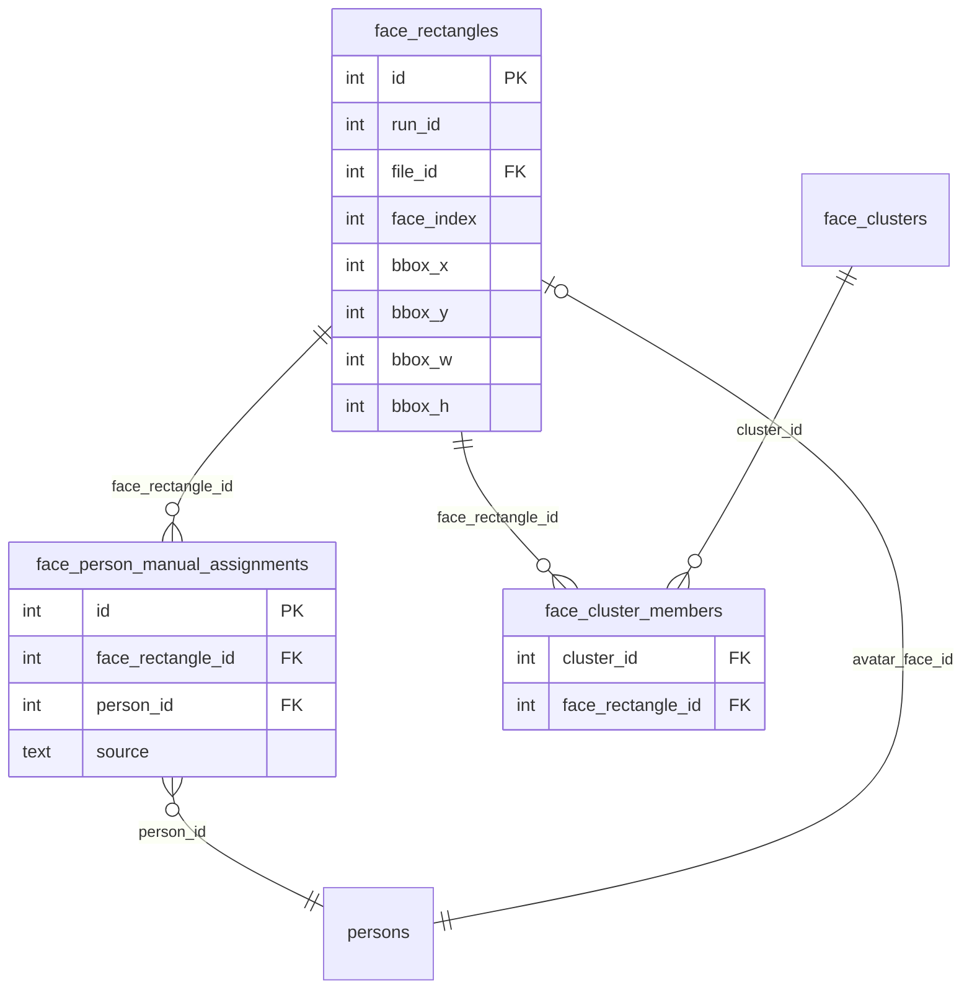
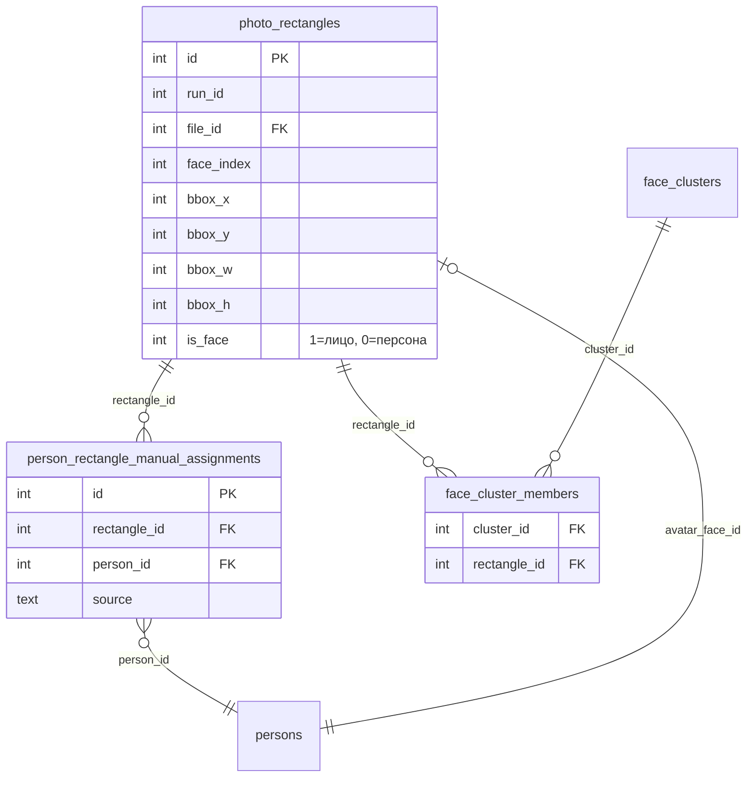

# Миграция переименования таблиц rectangles

## Статус выполнения

**Дата начала:** 2026-01-21

**Последнее обновление:** 2026-01-21

### Выполнено (ЭТАПЫ 1-11):

✅ **ЭТАП 1**: Создан скрипт миграции `backend/scripts/migration/rename_rectangles_tables.py` с полным функционалом:

- Резервное копирование БД
- Экспорт данных в JSON файлы (face_rectangles, face_person_manual_assignments, face_cluster_members)
- Проверки целостности (PRAGMA integrity_check, foreign_key_check)
- Dry-run режим
- Транзакции для атомарности
- Валидация до и после миграции

✅ **ЭТАП 2-5**: Обновлена схема БД в `backend/common/db.py`:

- Обновлен `_ensure_face_schema()` с миграционной логикой для автоматического переименования
- Добавлена поддержка колонки `is_face` в `photo_rectangles`
- Обновлены все CREATE TABLE для новых названий таблиц
- Обновлены все индексы с новыми именами

✅ **ЭТАП 6**: Обновлены все методы FaceStore в `backend/common/db.py`:

- Все запросы переведены на `photo_rectangles` и `person_rectangle_manual_assignments`
- Все `face_rectangle_id` заменены на `rectangle_id`
- Добавлен `is_face` в INSERT операции (по умолчанию 1)
- Добавлены фильтры `is_face = 1` для запросов, работающих с лицами

✅ **ЭТАП 7**: Обновлены все API endpoints:

- `backend/web_api/routers/faces.py`: все запросы обновлены, добавлена валидация `is_face`
- `backend/web_api/routers/face_clusters.py`: все запросы обновлены, добавлены фильтры `is_face = 1` для кластеров
- Endpoint `/api/faces/rectangle/create` теперь требует `is_face` в payload
- Endpoint `/api/faces/rectangle/update` обновлен для работы с новыми названиями

✅ **ЭТАП 8**: Обновлена логика распознавания лиц в `backend/logic/face_recognition.py`:

- Все запросы переведены на `photo_rectangles`
- Все `face_rectangle_id` заменены на `rectangle_id`
- Добавлены фильтры `is_face = 1` для запросов embeddings (только лица)
- Обновлены INSERT в `face_cluster_members` с новым именем колонки

✅ **ЭТАП 9**: Обновлен frontend `backend/web_api/static/photo_card.js`:

- Добавлен параметр `is_face` в payload при создании rectangle
- Все `face_rectangle_id` заменены на `rectangle_id`
- Поддержка переключателя "Лицо" для установки `is_face = 1` или `is_face = 0`

✅ **ЭТАП 10**: Обновлены ключевые скрипты и утилиты в `backend/scripts/`:

- `backend/scripts/tools/clear_restored_from_gold_assignments.py`: обновлены все упоминания таблиц
- `backend/scripts/tools/migrate_archive_faces.py`: обновлены все SQL запросы (face_rectangles → photo_rectangles, face_rectangle_id → rectangle_id)
- `backend/scripts/tools/restore_lost_faces_from_gold.py`: обновлены все запросы с новыми названиями таблиц и колонок
- `backend/scripts/migration/merge_outsider_persons.py`: обновлены упоминания таблиц
- `backend/scripts/migration/merge_outsider_person_26_to_6.py`: обновлены упоминания таблиц
- `backend/scripts/migration/remove_file_path_columns.py`: обновлено упоминание таблицы

**Примечание:** Остальные скрипты в `backend/scripts/` могут содержать упоминания старых названий, но они либо устаревшие (миграционные скрипты), либо используются редко. При необходимости их можно обновить позже.

✅ **ЭТАП 11**: Обновлены диаграммы entities:

- `docs/diagrams/entities_as_is.puml`: обновлены названия таблиц и колонок, добавлена колонка `is_face` в `photo_rectangles`
- `docs/diagrams/entities_to_be.puml`: обновлены названия таблиц и колонок, добавлена колонка `is_face` в `photo_rectangles`
- Обновлены все связи и заметки в диаграммах
- ✅ PNG файлы перегенерированы: `docs/diagrams/entities_as_is.png` и `docs/diagrams/entities_to_be.png`

✅ **ЭТАП 12**: Миграция БД выполнена автоматически и валидирована:

- Миграция была выполнена автоматически через `_ensure_face_schema()` в `backend/common/db.py` при первом запуске после обновления кода
- Валидация данных проведена через скрипт `backend/scripts/debug/validate_migration.py`
- Результаты валидации:
  - ✅ Целостность БД: OK
  - ✅ Foreign keys: OK
  - ✅ Все записи имеют `is_face` (NULL нет)
  - ✅ Все rectangles в кластерах имеют `is_face=1`
  - ✅ Все связи корректны (нет orphaned записей)
  - ✅ Индексы созданы (11 индексов)
- Статистика:
  - `photo_rectangles`: 52,552 записей (все с `is_face=1`)
  - `person_rectangle_manual_assignments`: 37 записей
  - `face_cluster_members`: 23,718 записей

## ✅ МИГРАЦИЯ ЗАВЕРШЕНА

Все этапы миграции успешно выполнены:

- ✅ ЭТАПЫ 1-9: Обновление кода (схема БД, API, логика, frontend)
- ✅ ЭТАП 10: Обновление скриптов и утилит
- ✅ ЭТАП 11: Обновление диаграмм и перегенерация PNG
- ✅ ЭТАП 12: Миграция БД выполнена автоматически и валидирована

**Дата завершения:** 2026-01-23

## Цель

Унифицировать структуру БД для работы с rectangles (лица и персоны):

- Переименовать `face_rectangles` → `photo_rectangles` (универсальное название)
- Переименовать `face_person_manual_assignments` → `person_rectangle_manual_assignments` (универсальное название)
- Переименовать `face_rectangle_id` → `rectangle_id` в таблицах привязок
- Добавить колонку `is_face` в `photo_rectangles` для различения лиц и персон

## Текущая структура



## Целевая структура



## Этапы миграции

### ЭТАП 1: Подготовка миграционного скрипта

**Файл:** `backend/scripts/migration/rename_rectangles_tables.py`

1. Создать скрипт миграции с проверками:

   - **Резервное копирование БД** (обязательно перед началом)
   - **Экспорт данных в JSON файлы** (дополнительная мера безопасности)
   - Проверка существования таблиц
   - Подсчет записей до миграции (для валидации после)
   - Проверка целостности данных (`PRAGMA integrity_check`)
   - Проверка foreign keys (`PRAGMA foreign_key_check`)
   - Dry-run режим (показывает что будет сделано без реальных изменений)
   - Транзакции для атомарности операций

2. Экспорт данных перед миграцией (в JSON файлы):

   - **face_rectangles** → `data/backups/migration_rename_rectangles_YYYYMMDD_HHMMSS/face_rectangles.json`
     - Экспортировать все 52,544 записей
     - Формат: JSON массив объектов с полями: id, run_id, file_id, face_index, bbox_x, bbox_y, bbox_w, bbox_h, confidence, presence_score, is_manual, manual_created_at, embedding, archive_scope, created_at
   - **face_person_manual_assignments** → `data/backups/migration_rename_rectangles_YYYYMMDD_HHMMSS/face_person_manual_assignments.json`
     - Экспортировать все 7 записей
     - Формат: JSON массив объектов с полями: id, face_rectangle_id, person_id, source, confidence, created_at
   - **face_cluster_members** → `data/backups/migration_rename_rectangles_YYYYMMDD_HHMMSS/face_cluster_members.json`
     - Экспортировать все записи (для проверки связей)
     - Формат: JSON массив объектов с полями: cluster_id, face_rectangle_id
   - Создать файл метаданных `data/backups/migration_rename_rectangles_YYYYMMDD_HHMMSS/metadata.json`:
     - Дата и время экспорта
     - Количество записей в каждой таблице
     - Хеш-суммы файлов (для проверки целостности)

3. Логика миграции (все в одной транзакции):

   - **Шаг 1:** Добавить колонку `is_face` в `face_rectangles` (DEFAULT 1, NOT NULL)
     - Сначала добавить с DEFAULT 1 (для существующих записей)
     - Затем убедиться, что все записи имеют значение: `UPDATE face_rectangles SET is_face = 1 WHERE is_face IS NULL`
     - Затем сделать NOT NULL (через пересоздание таблицы, так как SQLite не поддерживает ALTER COLUMN для NOT NULL)
   - **Шаг 2:** Переименовать таблицу `face_rectangles` → `photo_rectangles` - атомарная операция, данные не копируются
   - **Шаг 3:** Переименовать таблицу `face_person_manual_assignments` → `person_rectangle_manual_assignments` - атомарная операция
   - **Шаг 4:** Переименовать колонку `face_rectangle_id` → `rectangle_id` в `person_rectangle_manual_assignments` (через пересоздание с копированием данных)
   - **Шаг 5:** Переименовать колонку `face_rectangle_id` → `rectangle_id` в `face_cluster_members` (через пересоздание с копированием данных)
     - При пересоздании добавить проверку, что все rectangles в кластерах имеют `is_face = 1`
     - Проверить перед копированием: `SELECT COUNT(*) FROM face_cluster_members fcm JOIN photo_rectangles pr ON pr.id = fcm.rectangle_id WHERE pr.is_face != 1`
     - Если найдены rectangles с `is_face != 1` в кластерах - выдать ошибку (это не должно быть возможно, но проверка нужна)
   - **Шаг 6:** Обновить все индексы с новыми именами
   - **Шаг 7:** Валидация после миграции (подсчет записей, проверка целостности, проверка что все rectangles в кластерах имеют is_face = 1)
   - **Шаг 8:** Коммит транзакции только после успешного завершения всех операций

### ЭТАП 2: Обновление схемы БД

**Файл:** `backend/common/db.py`

1. Обновить `_ensure_face_schema()`:

   - Изменить CREATE TABLE для `photo_rectangles` (с колонкой `is_face INTEGER NOT NULL DEFAULT 1`)
   - Изменить CREATE TABLE для `person_rectangle_manual_assignments`
   - Обновить CREATE TABLE для `face_cluster_members` (с `rectangle_id`)
   - **Добавить CHECK constraint или триггер** для проверки, что rectangles в кластерах имеют `is_face = 1`
   - Обновить все индексы с новыми именами
   - Добавить миграционную логику для автоматического переименования при первом запуске

2. Обновить методы FaceStore:

   - Все методы, работающие с `face_rectangles` → `photo_rectangles`
   - Все методы, работающие с `face_person_manual_assignments` → `person_rectangle_manual_assignments`
   - Все запросы с `face_rectangle_id` → `rectangle_id`

### ЭТАП 3: Обновление API endpoints

**Файлы:**

- `backend/web_api/routers/faces.py`
- `backend/web_api/routers/face_clusters.py`
- `backend/web_api/routers/gold.py` (если использует face_rectangles)

1. Обновить все SQL запросы:

   - `face_rectangles` → `photo_rectangles`
   - `face_person_manual_assignments` → `person_rectangle_manual_assignments`
   - `face_rectangle_id` → `rectangle_id`
   - **ВАЖНО:** Во всех запросах, где раньше использовалась таблица `face_rectangles` (теперь `photo_rectangles`), добавить условие `is_face = 1` для фильтрации только прямоугольников с лицами:
     - Запросы для кластеров (face_cluster_members) - только лица
     - Запросы для ручных привязок (person_rectangle_manual_assignments) - могут быть и лица, и персоны, но для кластеров - только лица
     - Запросы для подсчета лиц на фото
     - Запросы для экспорта в gold
     - **Исключения:** Запросы, которые должны возвращать все прямоугольники (лица + персоны), например `/api/faces/rectangles` для карточки фотографий

2. Сделать поле `is_face` обязательным (NOT NULL):

   - В схеме БД: `is_face INTEGER NOT NULL DEFAULT 1`
   - Обновить миграцию: после добавления колонки с DEFAULT, сделать ее NOT NULL
   - В API endpoints при создании/обновлении rectangle:
     - Обязательно требовать параметр `is_face` в payload
     - Валидировать, что `is_face` присутствует и равен 0 или 1
     - При обновлении rectangle проверять, что `is_face` не был удален из payload

3. Контроль в `face_cluster_members`:

   - **Добавить CHECK constraint** или проверку в коде: прямоугольник в кластере должен иметь `is_face = 1`
   - При добавлении rectangle в кластер проверять: `SELECT is_face FROM photo_rectangles WHERE id = ?` и требовать `is_face = 1`
   - При создании кластера проверять все rectangles перед добавлением
   - В SQL запросах для кластеров всегда добавлять `AND pr.is_face = 1` при JOIN с `photo_rectangles`

4. Замена типа привязки (assignment_type):

   - **Запретить** изменение типа привязки для rectangles, которые находятся в кластерах:
     - При попытке изменить `assignment_type` с "cluster" на "manual_face" проверить, что rectangle не в кластере
     - Если rectangle в кластере - либо запретить изменение, либо:
       - Удалить rectangle из кластера (`face_cluster_members`)
       - Проверить, не остался ли кластер пустым
       - Если кластер пустой - удалить его или пометить как неактивный
   - При изменении с "manual_face" на "cluster":
     - Проверить, что rectangle имеет `is_face = 1` (только лица могут быть в кластерах)
     - Добавить rectangle в кластер через `face_cluster_members`
   - Обновить endpoint `/api/faces/rectangle/update` для обработки этих случаев

5. Обновить endpoints:

   - `/api/faces/rectangles` - возвращать все rectangles (лица + персоны), но помечать `is_face`
   - `/api/faces/rectangle/create` - требовать `is_face` в payload
   - `/api/faces/rectangle/update` - требовать `is_face` в payload, проверять кластеры при изменении типа привязки
   - `/api/faces/rectangle/delete` - проверять кластеры перед удалением
   - `/api/persons/{person_id}` - фильтровать только лица (`is_face = 1`) **только для запросов кластеров** (face_cluster_members), для ручных привязок (person_rectangle_manual_assignments) возвращать все rectangles (лица + персоны)
   - `/api/file-faces` - фильтровать только лица (`is_face = 1`), так как endpoint предназначен для получения именно лиц на файле
   - Все остальные endpoints, использующие эти таблицы:
     - Для запросов кластеров - всегда фильтровать `is_face = 1`
     - Для запросов ручных привязок - возвращать все rectangles (лица + персоны)
     - Для запросов, которые работают с "лицами" (по названию/назначению) - фильтровать `is_face = 1`

### ЭТАП 4: Обновление логики распознавания лиц

**Файл:** `backend/logic/face_recognition.py`

1. Обновить все запросы к БД:

   - `face_rectangles` → `photo_rectangles`
   - `face_rectangle_id` → `rectangle_id`
   - **ВАЖНО:** В запросах, которые работают с лицами (для кластеров, распознавания), добавить условие `is_face = 1`
   - При создании новых rectangles через распознавание лиц всегда устанавливать `is_face = 1`

### ЭТАП 5: Обновление frontend

**Файл:** `backend/web_api/static/photo_card.js`

1. Обновить комментарии и документацию (если есть упоминания старых названий)
2. Обновить логику создания rectangle с `is_face`:

   - При создании rectangle с переключателем "Лицо" = включен → `is_face = 1`
   - При создании rectangle с переключателем "Лицо" = выключен → `is_face = 0`

### ЭТАП 6: Обновление скриптов и утилит

**Файлы в `backend/scripts/`:**

- Все скрипты, использующие `face_rectangles` или `face_person_manual_assignments`
- Обновить SQL запросы в скриптах миграции, утилитах, анализаторах

### ЭТАП 7: Обновление диаграмм

**Файлы:**

- `docs/diagrams/entities_as_is.puml`
- `docs/diagrams/entities_to_be.puml`

1. Обновить названия таблиц и колонок
2. Добавить колонку `is_face` в `photo_rectangles`
3. Перегенерировать PNG диаграммы

### ЭТАП 8: Валидация и тестирование

1. Проверить целостность данных после миграции:

   - Подсчитать количество записей в `photo_rectangles` (должно быть: 52,544)
   - Проверить, что все записи имеют `is_face NOT NULL`
   - **Проверить, что все rectangles в кластерах имеют `is_face = 1`:**
     ```sql
     SELECT COUNT(*) FROM face_cluster_members fcm
     JOIN photo_rectangles pr ON pr.id = fcm.rectangle_id
     WHERE pr.is_face != 1
     ```


Должно вернуть 0

2. Проверить работу всех API endpoints:

   - Проверить, что все endpoints требуют `is_face` при создании/обновлении
   - Проверить, что запросы для кластеров фильтруют только `is_face = 1`
   - Проверить, что изменение типа привязки работает корректно с проверками кластеров

3. Проверить работу карточки фотографий:

   - Создание rectangle с `is_face = 1` и `is_face = 0`
   - Изменение типа привязки для rectangle в кластере
   - Попытка добавить rectangle с `is_face = 0` в кластер (должна быть запрещена)

4. Проверить работу распознавания лиц:

   - Новые rectangles создаются с `is_face = 1`
   - Запросы для кластеров фильтруют только лица

5. Проверить работу скриптов и утилит

## Детали миграции

### Переименование таблиц

```sql
-- 1. Добавить колонку is_face (DEFAULT 1 для существующих записей)
ALTER TABLE face_rectangles ADD COLUMN is_face INTEGER DEFAULT 1;

-- 2. Убедиться, что все существующие записи имеют is_face = 1
UPDATE face_rectangles SET is_face = 1 WHERE is_face IS NULL;

-- 3. Сделать is_face NOT NULL (через пересоздание таблицы, так как SQLite не поддерживает ALTER COLUMN для NOT NULL)
-- (выполняется в скрипте миграции через пересоздание таблицы)

-- 4. Переименовать таблицы
ALTER TABLE face_rectangles RENAME TO photo_rectangles;
ALTER TABLE face_person_manual_assignments RENAME TO person_rectangle_manual_assignments;

-- 5. Переименовать колонки
-- В person_rectangle_manual_assignments
-- (SQLite не поддерживает ALTER COLUMN, нужно пересоздать таблицу)

-- В face_cluster_members
-- (SQLite не поддерживает ALTER COLUMN, нужно пересоздать таблицу)
-- При пересоздании добавить проверку, что rectangle имеет is_face = 1
-- Это можно сделать через триггер или проверку в коде при INSERT
```

**Примечание:** SQLite не поддерживает `ALTER COLUMN`, поэтому для переименования колонок и добавления NOT NULL нужно пересоздать таблицы.

**ВАЖНО:** После миграции все rectangles в `face_cluster_members` должны иметь `is_face = 1`. Это проверяется в валидации после миграции.

### Обновление индексов

```sql
-- Удалить старые индексы
DROP INDEX IF EXISTS idx_face_rect_run;
DROP INDEX IF EXISTS idx_face_rect_file;
DROP INDEX IF EXISTS idx_face_rect_file_id;
DROP INDEX IF EXISTS idx_face_rect_archive_scope;
DROP INDEX IF EXISTS idx_face_person_manual_assignments_face;
DROP INDEX IF EXISTS idx_face_person_manual_assignments_person;
DROP INDEX IF EXISTS idx_face_person_manual_assignments_unique;
DROP INDEX IF EXISTS idx_face_cluster_members_face;

-- Создать новые индексы
CREATE INDEX idx_photo_rect_run ON photo_rectangles(run_id);
CREATE INDEX idx_photo_rect_file ON photo_rectangles(file_id);
CREATE INDEX idx_photo_rect_file_id ON photo_rectangles(file_id);
CREATE INDEX idx_photo_rect_archive_scope ON photo_rectangles(archive_scope);
CREATE INDEX idx_photo_rect_is_face ON photo_rectangles(is_face);
CREATE INDEX idx_person_rectangle_manual_assignments_rect ON person_rectangle_manual_assignments(rectangle_id);
CREATE INDEX idx_person_rectangle_manual_assignments_person ON person_rectangle_manual_assignments(person_id);
CREATE UNIQUE INDEX idx_person_rectangle_manual_assignments_unique ON person_rectangle_manual_assignments(rectangle_id, person_id);
CREATE INDEX idx_face_cluster_members_rect ON face_cluster_members(rectangle_id);
```

## Файлы для изменения

### Основные файлы БД

- `backend/common/db.py` - схема БД, методы FaceStore

### API endpoints

- `backend/web_api/routers/faces.py` - все endpoints для rectangles
- `backend/web_api/routers/face_clusters.py` - endpoints для кластеров и персон

### Логика

- `backend/logic/face_recognition.py` - распознавание лиц

### Frontend

- `backend/web_api/static/photo_card.js` - карточка фотографий

### Скрипты миграции

- `backend/scripts/migration/rename_rectangles_tables.py` - новый скрипт миграции

### Диаграммы

- `docs/diagrams/entities_as_is.puml`
- `docs/diagrams/entities_to_be.puml`

### Скрипты и утилиты

- Все файлы в `backend/scripts/` с упоминанием `face_rectangles` или `face_person_manual_assignments`

## Безопасность данных

**КРИТИЧЕСКИ ВАЖНО:** В таблице `face_rectangles` хранится **52,544 записей** - это критически важные данные!

### Гарантии безопасности операций

1. **`ALTER TABLE ... RENAME TO`** - атомарная операция в SQLite:

   - Данные **НЕ копируются**, только меняется имя таблицы в метаданных
   - Операция мгновенная и безопасная
   - **Нет риска потери данных**

2. **`ALTER TABLE ... ADD COLUMN`** - безопасная операция:

   - Добавляет колонку с DEFAULT значением
   - Существующие данные **не изменяются**
   - Новые записи получают DEFAULT значение (1 для is_face)

3. **Переименование колонок через пересоздание таблицы:**

   - Создается временная таблица
   - Данные копируются через `INSERT INTO ... SELECT FROM`
   - **Проверка количества скопированных записей** (должно совпадать с исходным)
   - Только после успешного копирования удаляется старая таблица
   - Используется **транзакция** для атомарности

### Меры предосторожности (ОБЯЗАТЕЛЬНО)

1. **Резервное копирование БД (ПЕРЕД НАЧАЛОМ):**
   ```bash
   cp data/photosorter.db data/photosorter.db.backup_YYYYMMDD_HHMMSS
   ```


   - Проверить размер backup файла
   - Сохранить backup в безопасном месте
   - **Не начинать миграцию без backup!**

2. **Экспорт данных в файлы (ДОПОЛНИТЕЛЬНАЯ МЕРА БЕЗОПАСНОСТИ):**

   - Скрипт автоматически экспортирует данные перед миграцией:
     - `face_rectangles` (52,544 записей) → JSON файл
     - `face_person_manual_assignments` (7 записей) → JSON файл
     - `face_cluster_members` (все записи) → JSON файл
   - Файлы сохраняются в `data/backups/migration_rename_rectangles_YYYYMMDD_HHMMSS/`
   - Создается файл метаданных с количеством записей и хеш-суммами
   - **Эти файлы можно использовать для ручного восстановления данных при необходимости**

3. **Валидация перед миграцией:**

   - Подсчитать количество записей в `face_rectangles` (ожидается: 52,544)
   - Подсчитать количество записей в `face_person_manual_assignments` (ожидается: 7)
   - Проверить целостность: `PRAGMA integrity_check`
   - Проверить foreign keys: `PRAGMA foreign_key_check`
   - Проверить, что нет orphaned записей

3. **Dry-run режим:**

   - Скрипт миграции должен поддерживать `--dry-run` режим
   - В dry-run режиме показывать, что будет сделано, **без реальных изменений**
   - Проверять все операции перед выполнением

4. **Валидация после миграции:**

   - Подсчитать количество записей в `photo_rectangles` (должно быть: 52,544)
   - Проверить, что все foreign keys работают
   - Проверить, что все индексы созданы
   - Проверить, что `is_face = 1` для всех существующих записей
   - Проверить работу API endpoints
   - Выполнить `PRAGMA integrity_check` после миграции

5. **Транзакции:**

   - Все операции миграции выполняются в **одной транзакции**
   - При ошибке - автоматический откат (rollback)
   - Коммит только после успешного завершения всех операций

6. **Проверка целостности:**

   - После миграции выполнить `PRAGMA integrity_check`
   - Проверить foreign keys: `PRAGMA foreign_key_check`
   - Проверить, что все связи работают корректно

### Процедура миграции

1. **Подготовка:**

   - Создать backup БД: `cp data/photosorter.db data/photosorter.db.backup_YYYYMMDD_HHMMSS`
   - Запустить скрипт в `--dry-run` режиме
   - Проверить вывод, убедиться что все операции корректны

2. **Выполнение:**

   - Запустить скрипт миграции (без `--dry-run`)
   - Скрипт автоматически:
     - **Экспортирует данные в JSON файлы** (в `data/backups/migration_rename_rectangles_YYYYMMDD_HHMMSS/`)
     - Создаст транзакцию
     - Выполнит все операции
     - Проверит количество записей после каждой операции
     - Закоммитит только при успехе

3. **Проверка:**

   - Проверить количество записей
   - Проверить целостность БД
   - Проверить работу API
   - Проверить работу карточки фотографий
   - Убедиться, что JSON файлы с экспортированными данными сохранены

### Откат (если потребуется)

Если что-то пошло не так:

1. Остановить приложение
2. **Вариант 1 (предпочтительный):** Восстановить БД из backup:
   ```bash
   cp data/photosorter.db.backup_YYYYMMDD_HHMMSS data/photosorter.db
   ```

3. **Вариант 2 (если backup поврежден):** Восстановить данные из JSON файлов:

   - Использовать скрипт восстановления (будет создан вместе с миграцией)
   - Или вручную импортировать данные из JSON файлов в `data/backups/migration_rename_rectangles_YYYYMMDD_HHMMSS/`

4. Проверить целостность восстановленной БД

1. **Резервное копирование (ОБЯЗАТЕЛЬНО):**

   - Создать полный backup БД перед миграцией: `cp data/photosorter.db data/photosorter.db.backup_YYYYMMDD_HHMMSS`
   - Проверить размер backup файла
   - Сохранить backup в безопасном месте

2. **Валидация перед миграцией:**

   - Подсчитать количество записей в `face_rectangles` (ожидается: 52,544)
   - Подсчитать количество записей в `face_person_manual_assignments` (ожидается: 7)
   - Проверить целостность foreign keys
   - Проверить, что нет orphaned записей

3. **Dry-run режим:**

   - Скрипт миграции должен поддерживать `--dry-run` режим
   - В dry-run режиме показывать, что будет сделано, без реальных изменений
   - Проверять все операции перед выполнением

4. **Валидация после миграции:**

   - Подсчитать количество записей в `photo_rectangles` (должно совпадать с исходным)
   - Проверить, что все foreign keys работают
   - Проверить, что все индексы созданы
   - Проверить, что `is_face = 1` для всех существующих записей
   - Проверить работу API endpoints

5. **Транзакции:**

   - Все операции миграции выполняются в одной транзакции
   - При ошибке - автоматический откат (rollback)
   - Коммит только после успешного завершения всех операций

6. **Проверка целостности:**

   - После миграции выполнить `PRAGMA integrity_check`
   - Проверить foreign keys: `PRAGMA foreign_key_check`
   - Проверить, что все связи работают корректно

## Зависимости

- Миграция должна быть выполнена после завершения ЭТАП 2 (карточка фотографий), так как там уже используется новая функциональность создания rectangles
- Миграция не блокирует другие задачи, но требует обновления всех мест использования

## Оценка времени

- ЭТАП 1: 3-4 часа (создание скрипта миграции с экспортом данных)
- ЭТАП 2: 3-4 часа (обновление схемы БД)
- ЭТАП 3: 4-6 часов (обновление API endpoints)
- ЭТАП 4: 1-2 часа (обновление логики распознавания)
- ЭТАП 5: 1 час (обновление frontend)
- ЭТАП 6: 2-3 часа (обновление скриптов)
- ЭТАП 7: 1 час (обновление диаграмм)
- ЭТАП 8: 2-3 часа (валидация и тестирование)

**Итого:** 17-24 часа (2-3 рабочих дня)

**Примечание:** Экспорт данных в JSON файлы добавляет ~1 час к ЭТАП 1, но это критически важно для безопасности данных (52,544 записей в face_rectangles и 7 записей в face_person_manual_assignments).